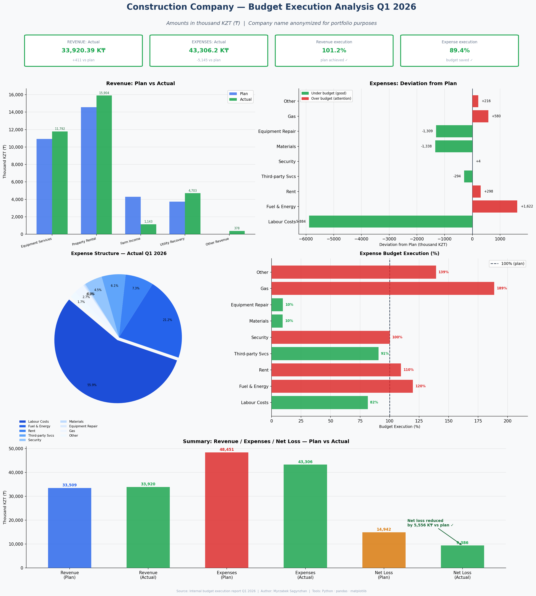

# 📊 Budget Execution Analysis — Q1 2026

**Project:** Industrial Internship 1 | SDU University | June 2026  
**Author:** Myrzabek Sagynzhan  
**Tools:** Python · pandas · matplotlib · openpyxl

> ⚠️ Company name and sensitive details anonymized for portfolio purposes.

---

## 🎯 Project Goal

Analyze the Q1 2026 budget execution report of a construction company:
- Compare **planned vs actual** revenues and expenses
- Identify **over-budget** and **under-budget** items
- Calculate **deviation percentages** for each line item
- Visualize key financial metrics in a dashboard

---

## 📁 Files

| File | Description |
|---|---|
| `01_Budget_Execution_Q1_2026.ipynb` | Main analysis notebook |
| `01_budget_analysis_ANON.png` | Dashboard (5-panel visualization) |

> 📌 Source data file not included due to confidentiality.  
> Analysis results are fully visible in notebook outputs and the dashboard image.

---

## 📊 Dashboard Preview



---

## 🔑 Key Findings

| Finding | Detail |
|---|---|
| Revenue plan exceeded | +411 thousand KZT (+1.2%) |
| Expense budget saved | −5,145 thousand KZT (−10.6%) |
| Net loss reduced | −9,386 actual vs −14,942 planned |
| Labour costs under budget | −18.5% vs plan |
| Gas costs over budget | +88.7% — risk area |
| Utilities overrun | +189% — risk area |

---

## 🛠️ How to Run

```bash
pip install pandas matplotlib openpyxl
jupyter notebook 01_Budget_Execution_Q1_2026.ipynb
```

Replace
